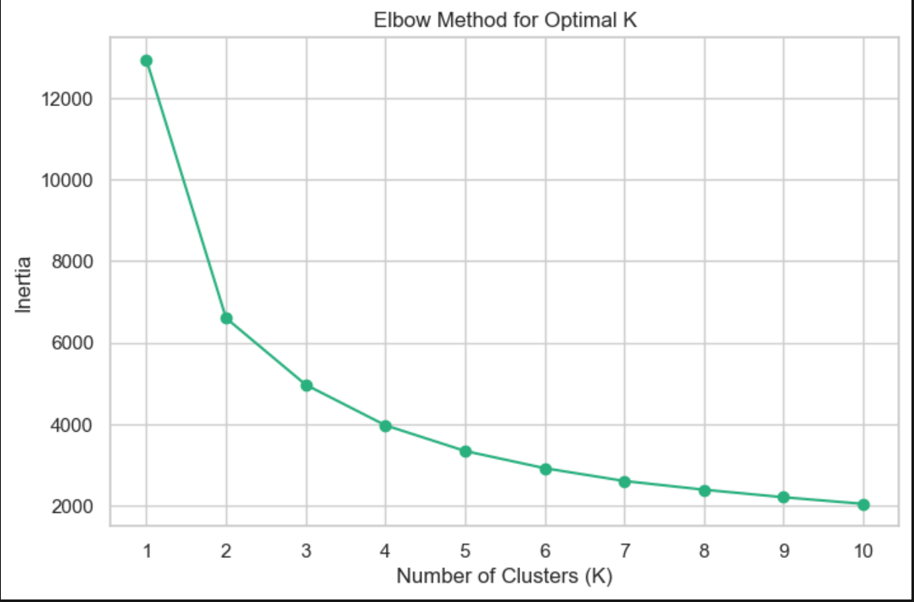
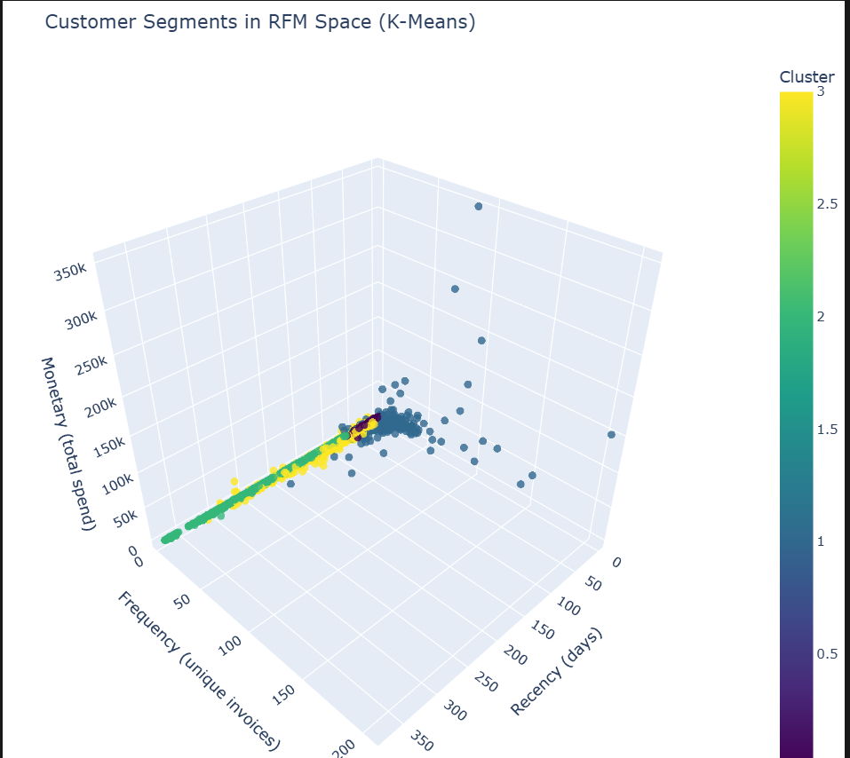

# Finding the Whales: Data-Driven Customer Segmentation for Global Retail

## Business Problem
I built this project around a simple business question: how do I help a retail team spend marketing dollars more intelligently? By separating high-value customers from customers who are drifting away, I can support better retention strategy, smarter reactivation campaigns, and stronger long-term customer lifetime value.

## Project Impact
Instead of treating the entire customer base as one audience, I turned raw transactions into behavior-based personas a marketing team could actually use.

I used the final segments to highlight where the business should protect revenue, where it should invest in loyalty, and where it should stop sending generic campaigns that waste budget.

> **Key Insight:** Monetary value looked exciting at first, but it was also the feature most likely to overpower the rest of the model if I did not tame its skew.
>
> **Pro-Tip:** In retail data, cancellations and returns can quietly poison segmentation logic if you do not remove them before building customer-level features.

## Tech Stack
- **Python:** `pandas`, `scikit-learn`, `plotly`, `numpy`, `seaborn`, `matplotlib`
- **SQL:** `SQLite`
- **Environment:** `Jupyter Notebooks`

## Data Pipeline
### 1. Data Ingestion
In `1_data_ingestion.ipynb`, I loaded the Online Retail II dataset from `./data/`, removed rows with missing customer IDs, filtered out canceled invoices that started with `C`, and saved the cleaned transactions into `retail.db`.

### 2. Feature Engineering
In `2_rfm_analysis.ipynb`, I grouped transactions by `CustomerID` and built three core features:
- **Recency:** how recently each customer purchased
- **Frequency:** how often each customer purchased
- **Monetary:** how much each customer spent

I anchored Recency using a snapshot date set to one day after the most recent invoice in the dataset, then filtered out customers whose Monetary value was zero or negative.

### 3. Modeling
In `3_clustering_model.ipynb`, I checked feature skew with distribution plots, applied `np.log1p` to stabilize the long tails, scaled the features with `StandardScaler`, and trained a K-Means clustering model.

## Strategic Choice: Why I Chose K=4
When I ran the Elbow Method, the curve bent around **K=2**. That gave me a technically defensible answer, but it did not give me enough business resolution.

I chose **K=4** because I wanted personas a business stakeholder could act on immediately: protect top customers, grow loyal ones, nurture newer ones, and re-engage customers who were fading out.

## Customer Personas

| Cluster ID | Persona | Mean Recency | Mean Frequency | Mean Monetary | Marketing Action |
|---|---|---:|---:|---:|---|
| 1 | Champions | 13.89 | 13.58 | 7422.65 | Reward with VIP-only early access to new products and premium loyalty perks to maximize retention and advocacy. |
| 3 | Loyal Customers | 82.66 | 4.14 | 1775.16 | Increase repeat purchase frequency with personalized cross-sell bundles and milestone-based loyalty rewards. |
| 0 | Promising Newcomers | 23.14 | 2.05 | 565.80 | Nurture second and third purchases using welcome journeys, limited-time incentives, and product discovery recommendations. |
| 2 | Hibernating / Lost | 187.57 | 1.29 | 302.53 | Run win-back campaigns with strong reactivation offers and targeted reminders focused on previously viewed or purchased categories. |

## Visualizations




## Repository Structure
```text
.
├── data/
├── 1_data_ingestion.ipynb
├── 2_rfm_analysis.ipynb
├── 3_clustering_model.ipynb
├── retail.db
├── project_discovery_log.txt
└── README.md
```

## How to Run
### 1. Create and activate a virtual environment
```powershell
python -m venv venv
.\venv\Scripts\Activate.ps1
```

### 2. Install dependencies
```powershell
pip install pandas numpy scikit-learn seaborn matplotlib plotly jupyter openpyxl
```

### 3. Launch Jupyter
```powershell
jupyter notebook
```

### 4. Run the notebooks in order
1. `1_data_ingestion.ipynb`
2. `2_rfm_analysis.ipynb`
3. `3_clustering_model.ipynb`

## Challenges & Troubleshooting
Two parts of this project took more iteration than I expected.

First, I had to handle negative quantities and canceled invoices carefully because they could distort customer value and make the segmentation look stronger than it really was. Second, Monetary was heavily right-skewed, so I spent time iterating on the log transformation approach until the distributions looked stable enough for K-Means to behave sensibly.

## Key Decision Notes
I removed canceled invoices before building customer-level features because I wanted the model to reflect completed buying behavior, not operational noise.

I applied both log transformation and scaling because K-Means is driven by distance, and I did not want large spenders to overwhelm the signal from purchase frequency or recency.

I mapped the final clusters into named personas because the whole point of this project was business action, not just a prettier scatter plot.

## Why I Built This
As a student in the **ALX Data Science program**, I wanted to apply my SQL and Python skills to a real business problem with commercial consequences. I built this project to move beyond simple model metrics and practice the kind of work that ties analysis directly to business impact, retention strategy, and customer value growth.

## Source of Truth
I keep all major technical decisions, business findings, and interpretation notes in `project_discovery_log.txt`.
